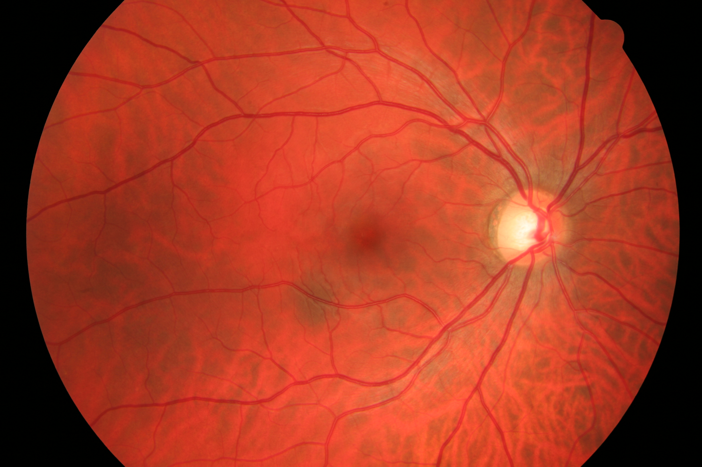
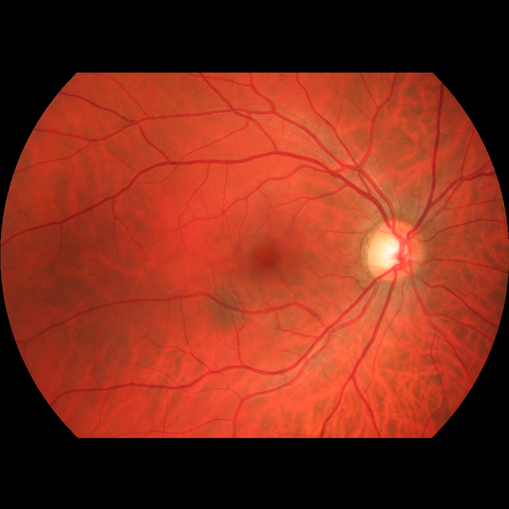
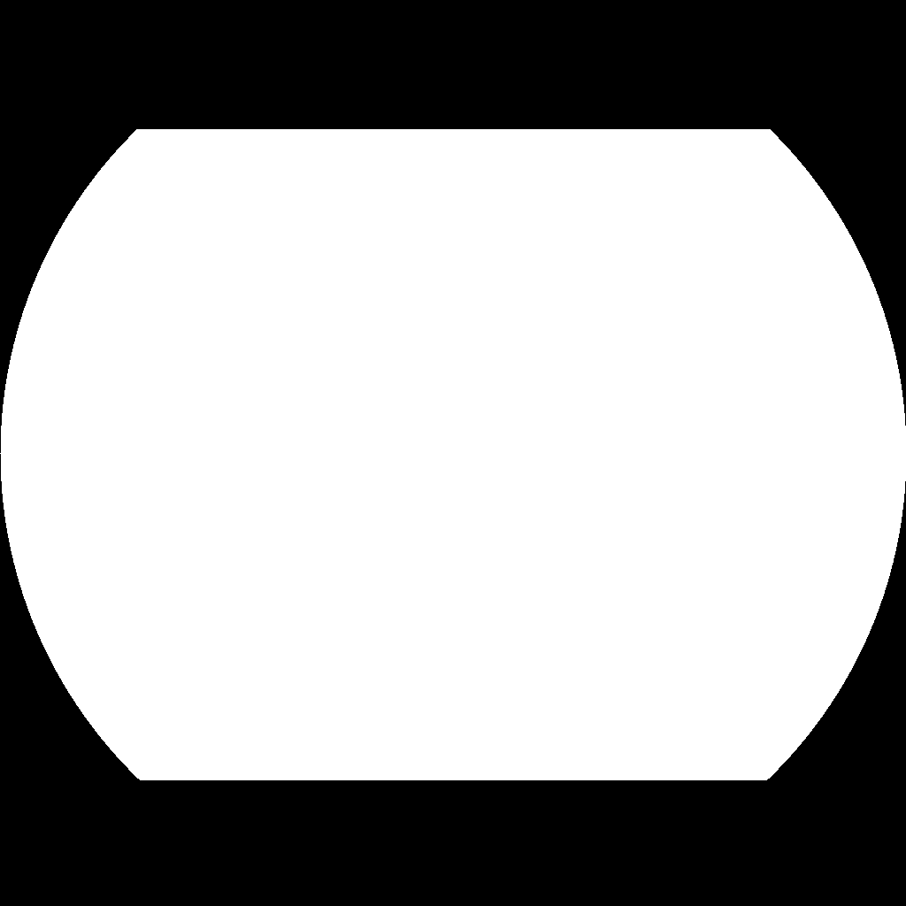
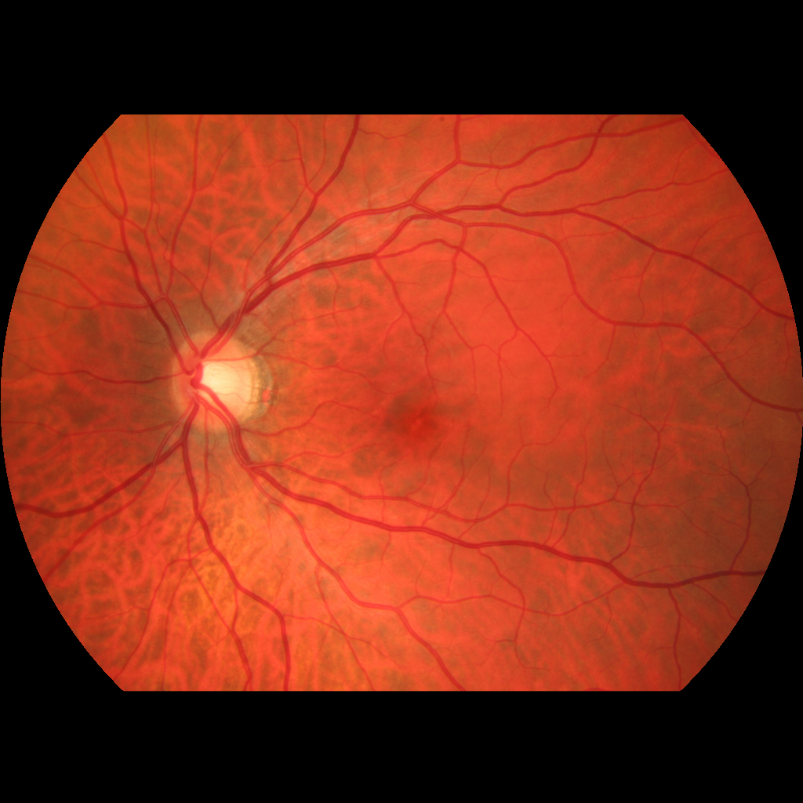
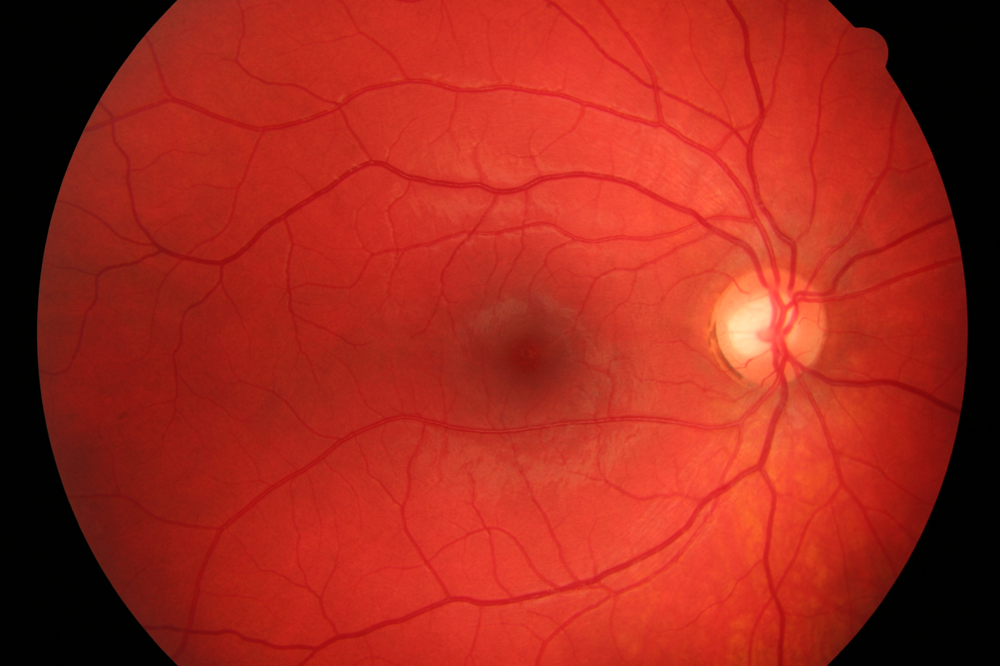
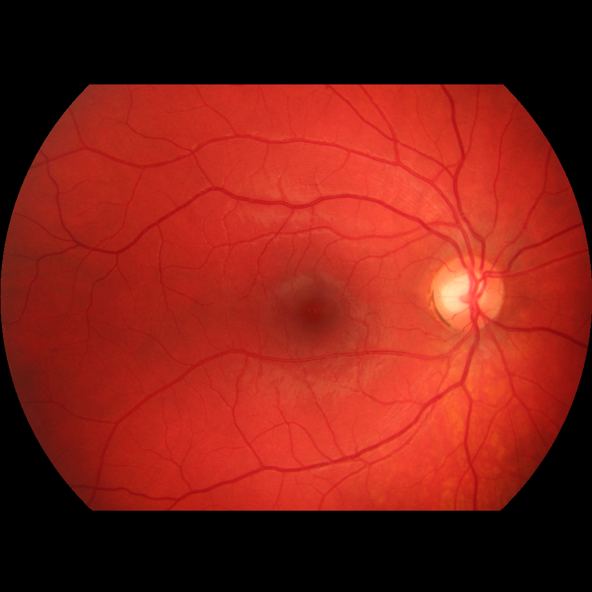
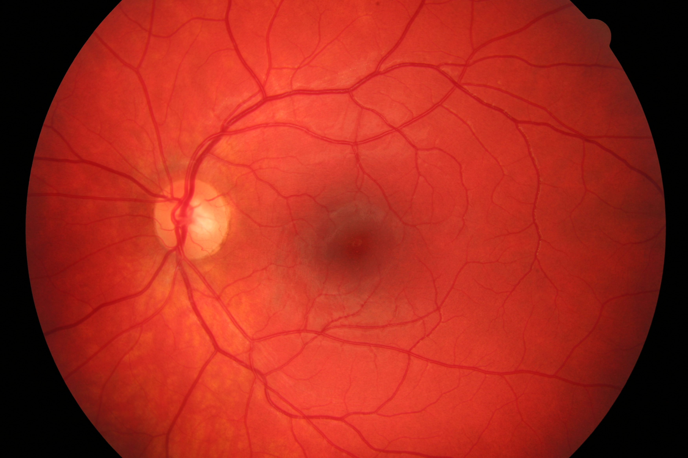
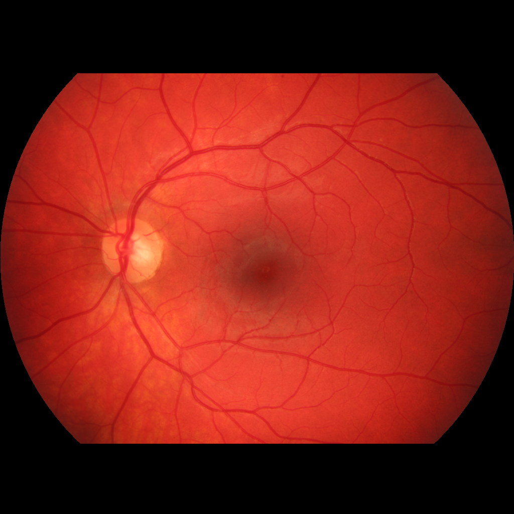
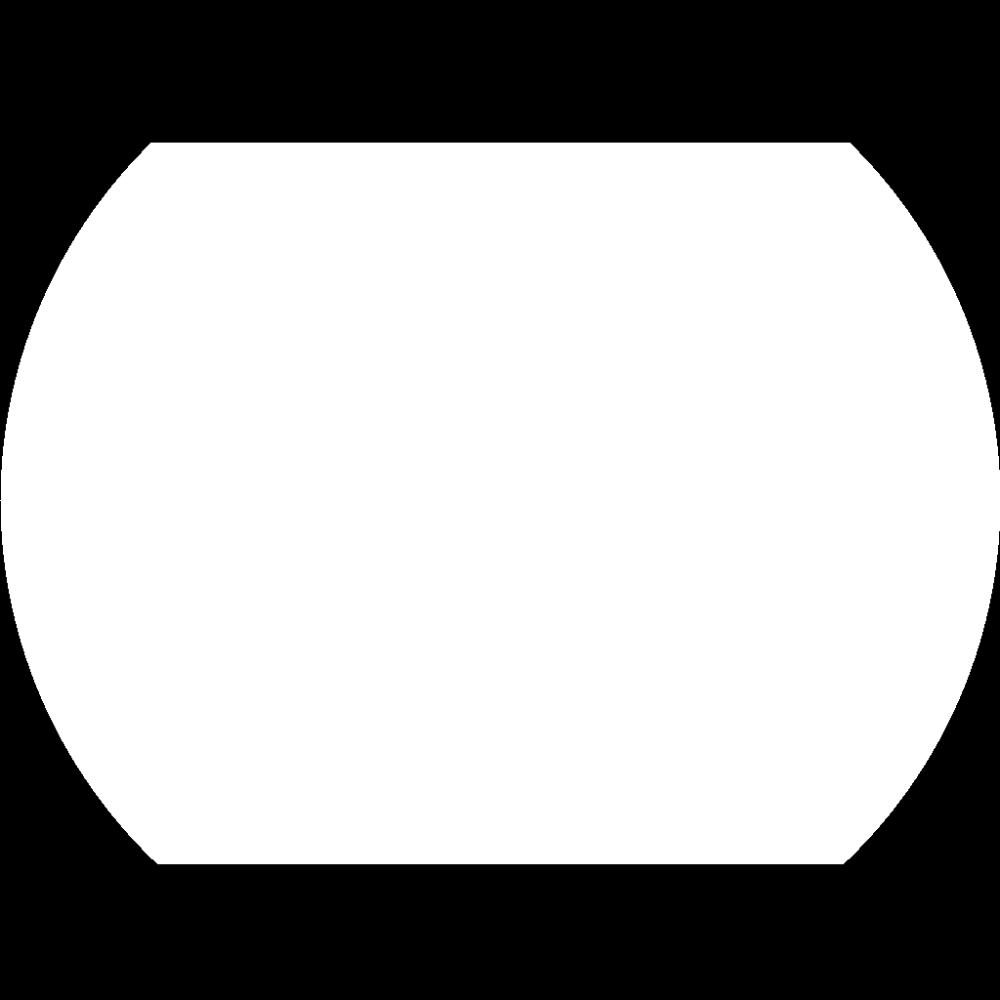

# Overview
Fundus images are processed by
(1) finding circular mask by least-squares expectation-maximization fitting of a circular shape to image edges, and 
(2) tightly cropping the image around the found circle.

This way, all images are equally centered, some background pixels are removed, and a boolean mask of the extracted circle is saved.


|   original   |   cropped  | mask |
|------------|------------|------------|
||||
||||
||||
||||


# Installation
Install directly from source
```python
git clone https://github.com/berenslab/fundus_circle_cropping
cd fundus_circle_cropping
pip install -e .
```

# Basic example
Download some example data of healthy fundus images from https://www5.cs.fau.de/research/data/fundus-images/ with a bash script
```bash
bash download_data/download.sh
```
This will create a datafolder `data/images` to save the images and will create an image identity file `data/ids.lst` with list of the file names.

To crop the downloaded fundus images, run the example script [crop.py](crop.py) that expects a configuration [basic_example.yaml](configs/basic_example.yaml) and runs over the downloaded data.
```python
python crop.py -c ./configs/basic_example.yaml
```

Preprocessed images will be saved in `data/images_cropped` and the corresponding circular masks in `data/masks`.

# Note
If you run the code on other retinal fundus datasets, adjust the `root_folder` in the [config file](configs/basic_example.yaml) provide a text file of image names. The `preprocessing parameters` were optimized with the [kaggle-dr-dataset](https://www.kaggle.com/c/diabetic-retinopathy-detection/data) and may need to be adjusted for other datasets.